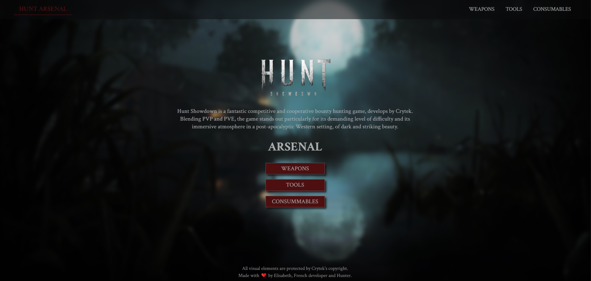

# Hunt-Showdown-Arsenal

## Description
Welcome to the **Hunt Showdown Arsenal**, a personal projet made with love ! You can find an arsenal featuring all the weapons, tools, and consumables available in the game. 

## Technos 
- HTML/CSS
- JavaScript Vanilla
- Node.js/Express/EJS

## Preview 

## How to use ?
Follow these steps to set up and use the Hunt Showdown Arsenal :
1. Clone the repo
2. Make sure you have Node.js installed, if not you can download it from https://nodejs.org/ 
3. Install Dependencies : `npm install`
4. Start the Server: `npm run start`
5. Access the Application: open your web browser and navigate to http://localhost:3000 
6. Explore the Hunt Showdown Arsenal !
